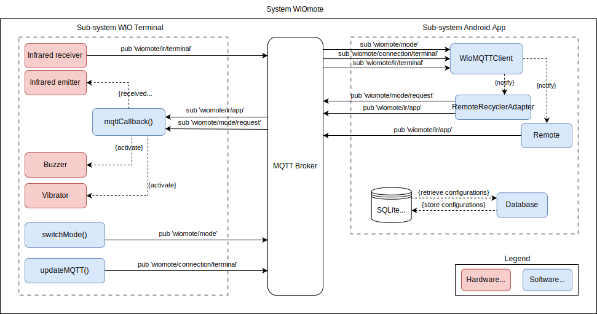

# WIOmote
[](https://git.chalmers.se/courses/dit113/2024/group-9/wiomote.wiki.git) [](https://git.chalmers.se/courses/dit113/2024/group-9/wiomote/-/jobs) [](https://git.chalmers.se/courses/dit113/2024/group-9/wiomote/-/jobs/artifacts/main/raw/app/build/outputs/apk/release/app-release.apk?job=build_android) [](https://git.chalmers.se/courses/dit113/2024/group-9/wiomote/-/jobs/artifacts/main/raw/terminal/build/output/terminal.ino.bin?job=build_arduino)
\
\
A wireless controlled configurable remote built on the [WIO Terminal](https://www.seeedstudio.com/Wio-Terminal-p-4509.html).


## Project Description

The project is named “*WIOmote*”, symbolizes the integration of the Seed Wio Terminal as the core device with the functionality of a remote, representing the product's purpose.
\
The product in itself is a universal remote, which is intended to serve as a substitute for standard infrared based remotes, consolidating control of several devices into one. This is achieved using an IR sensor and emitter, navigated by a wirelessly connected device. Users can access or create numerous configurations from which commands can be sent to a terminal for immediate action.
\
For basic functions like turning on and off or basic navigation, the terminal can operate independently of a mobile device but is intended to be paired with a device to access the more advanced features.

## Demo

Curious to see how it works in action? Check out our demo video on [YouTube](https://youtu.be/9HRPDOEo8KA)!

[](https://youtu.be/9HRPDOEo8KA)

## Purpose and Benefits

The WIOmote is intended to be a convenient and straightforward solution in managing multiple devices by centralizing the point of usage into one single device, accompanied by a simple and easily navigable interface for a seamless experience.
\
Since the WIOmote is highly customizable, it is an excellent solution for users with limited vision or mobility, as well as for the family. The app allows creation of custom remote profiles, custom names for buttons as well as switching between remote configuration profiles, giving the user a lot of freedom in tailoring their experience.
\
Furthermore, the WIOmote also suffices as an environmentally friendly alternative to physical remotes, as it can both serve as a back-up for existing remotes as well as replacing them. ’no more need to buy a new remote if it breaks, since it can easily be stored as one of many remote configurations in the app, saving both money and the environment.

## System Design

The system's architecture is based on an *MQTT Broker* alongside various hardware components (infrared receiver and emiter, buzzer, vibrator) controlled by software modules. These modules receive commands from the broker, manage configurations, and interpret infrared configuration data.

- **WIO Terminal:** The hardware component responsible for receiving commands and controlling devices.

- **Android App:** The mobile application responsible for sending commands to the WIO Terminal and establishing wireless communication.



## Dependencies & Requirements
The following section lists the dependencies and requirements for the project:

1. [Wio Seeed Terminal](https://www.seeedstudio.com/Wio-Terminal-p-4509.html)
2. [Arduino IDE](https://www.arduino.cc/en/software) 
   
   2.1. Arduino Libraries — Add to Arduino IDE using the [Arduino Library Manager](https://support.arduino.cc/hc/en-us/articles/5145457742236-Add-libraries-to-Arduino-IDE):
   - [TFT_eSPI](https://github.com/Bodmer/TFT_eSPI)
   - [Arduino Json](https://arduinojson.org/)
   - [PubSubClient](https://github.com/knolleary/pubsubclient)
   - [Seeed Arduino rpcBLE](https://github.com/Seeed-Studio/Seeed_Arduino_rpcBLE)
   - [Seeed Arduino rpcWiFi](https://github.com/Seeed-Studio/Seeed_Arduino_rpcWiFi)
   - [Seeed Arduino rpcUnified](https://github.com/Seeed-Studio/Seeed_Arduino_rpcUnified)
   - [WIOmote IRLib](https://git.chalmers.se/courses/dit113/2024/group-9/wiomote_irlib)
   
   2.2. Arduino Board Managers - Add to Arduino IDE by going to `File > Preferences` and pasting the following link into `Aditional Board Managers URLs`:
```shell
https://files.seeedstudio.com/arduino/package_seeeduino_boards_index.json
```
3. [Grove Sensor List](#system-sensors)

## System Sensors

The team has considered the following sensors:

| Sensor & Actuators                           | URL                                                           |
|----------------------------------------------|---------------------------------------------------------------|
| Infrared Emitter (Grove - Infrared Emitter)  | [link](https://wiki.seeedstudio.com/Grove-Infrared_Emitter)   |
| Infrared Receiver (Grove - Infrared Receiver)| [link](https://wiki.seeedstudio.com/Grove-Infrared_Receiver/) |
| Buzzer (built-in)                            | -                                                             |
| Vibration Motor (Grove - Vibration Motor)    | [link](https://wiki.seeedstudio.com/Grove-Vibration_Motor/)   |

## Instalation

### Flashing WIO binaries

1. Have [arduino-cli](https://github.com/arduino/arduino-cli) installed. _You can check your installation by running `arduino-cli version` in your shell._ _Use the following _[_resource_](https://arduino.github.io/arduino-cli/0.35/installation/)_ to help you install or fix issues with your current instalation._
2. Download the compiled Arduino binary: [](https://git.chalmers.se/courses/dit113/2024/group-9/wiomote/-/jobs/artifacts/main/raw/terminal/build/output/terminal.ino.bin?job=build_arduino)
3. Connect your WIO Terminal to a USB port and turn it on.
4. In your shell, run `arduino-cli board list` to check which port the device is connected to.
5. Flash the binary using: 
```shell 
arduino-cli upload -i <path to terminal.ino.bin> -b Seeeduino:samd:seeed_wio_terminal -p <port identifier>
```
   * `<path to terminal.ino.bin>` - Replace this with the path to the binary file downloaded in step 1.
   * `<port identifier>` - Replace this with the port displayed in step 3. Look for _FQBN Seeeduino:samd:seeed_wio_terminal_.

### Installing Android app

1. Download the compiled Android app: [](https://git.chalmers.se/courses/dit113/2024/group-9/wiomote/-/jobs/artifacts/main/raw/app/build/outputs/apk/release/app-release.apk?job=build_android)
2. Run the downloaded file from your Android device. 
\
**NOTE:** Your device might request you to allow installation of unknown apps from unknown sources. This is normal and is required to install any third party application.

## Usage

For detailed instructions and a complete guide to using all the features, please refer to the [user manual](https://git.chalmers.se/courses/dit113/2024/group-9/wiomote/-/wikis/documentation/User%20Manual).


## Acknowledgments

The project is being built on:

- [WIO Terminal](https://www.seeedstudio.com/Wio-Terminal-p-4509.html) platform developed by [Seeed Studio](https://www.seeedstudio.com/).
- [Android Open Source Project (AOSP)](https://source.android.com/) using the [Android Software Development Kit (SDK)](https://developer.android.com/studio).

### Team members and contributions
- Aliaksei Khval (@aliaksei): Terminal MQTT connection, on-screen feedback for connection status, populated the configuration database including the creation of cloning scripts.
- Maksims Orlovs (@orlovs): Android MQTT connection, terminal action flow, cloning behavior and data transfer between components.
- Răzvan Albu (@razvana): Android application design and logic, database implementation and pipelines.
- Victoria Rönnlid (@ronnlid): Terminal UI, visual, audio and haptic feedback.

## License
The project is licensed under the *MIT License*. Refer to the [LICENSE](https://git.chalmers.se/courses/dit113/2024/group-9/wiomote/-/blob/main/LICENSE?ref_type=heads) file for more information.
